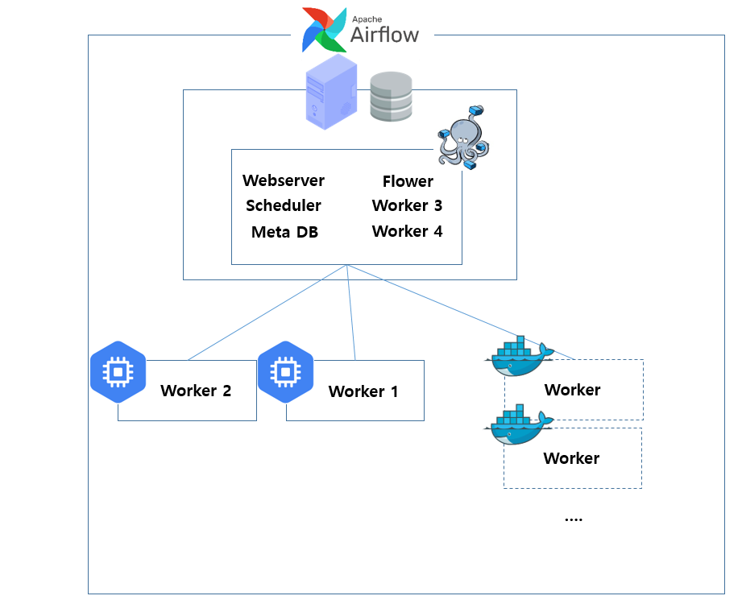
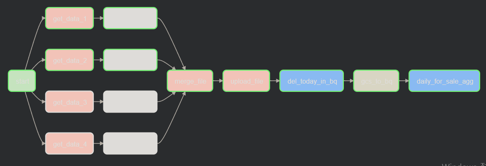

# gcp_estate_project

## 부동산 매물 데이터를 활용한 데이터 파이프라인 구축
부동산 일일 매물량과 변화량 관찰을 위해 데이터 수집부터 집계까지의 데이터 파이프라인을 구축한 프로젝트입니다.
  
일일 매물량을 집계하여 시간에 따른 매물량의 변화 추이를 분석할 수 있습니다.
  

  

# Data Architecture 
데이터 인프라는 데이터 수집 속도를 향상시키기 위해 Celery Executor를 사용한 분산서버로 구축하였습니다.  
Master 노드를 자택 Local PC에 Docker Compose를 통해 구성하였고 2개의 Worker를 GCE로 구성하여 총 4개의 Worker를 사용했습니다.

### Infra Architecture 

  
  

데이터 파이프라인은 GCP기반의 ELT Process로 구성하였습니다.  
Airflow를 사용하여 데이터 수집부터 집계까지를 자동화하였고 멱등성을 보장하여 재실행에도 중복데이터가 발생하지 않도록 설계하였습니다. 

### Airflow Taskflow

  

## Data Ingestion
데이터 수집은 네이버 부동산 사이트의 매물 데이터를 이용했습니다. 사이트내 아파트별로 올라온 매물을 확인할 수 있고 매물에 대한 정보 등이 제공되고 있습니다.  
  

  
일일 매물량을 확인하기 위해 Airflow를 통해 데일리 매물량 수집을 자동화하였고 데이터 타입, null값 제거 등의 전처리를 거친 csv파일을 GCS에 저장했습니다.
  

  

## Workflow 자동화
GCS에 저장된 Raw Data를 데이터분석을 위해 Bigquery에 적재하였고 일일 매물량 확인을 위해 아파트별로 매물량 수를 집계하여 DataMart를 구성했습니다.  
이러한 과정을 Airflow를 통해 데일리 Workflow로 구성하여 자동화했습니다. Airflow는 backfill기능을 통해 자동화 및 수행되지 않았던 기간의 Workflow를 채우는 용도로도 활용하고 있습니다.
  

   
<!-- backfill을 통해 실행되지 않았던 전체 태스크, 부분 태스크를 수행하여 데이터 공백을 제거했습니다.
  
 -->